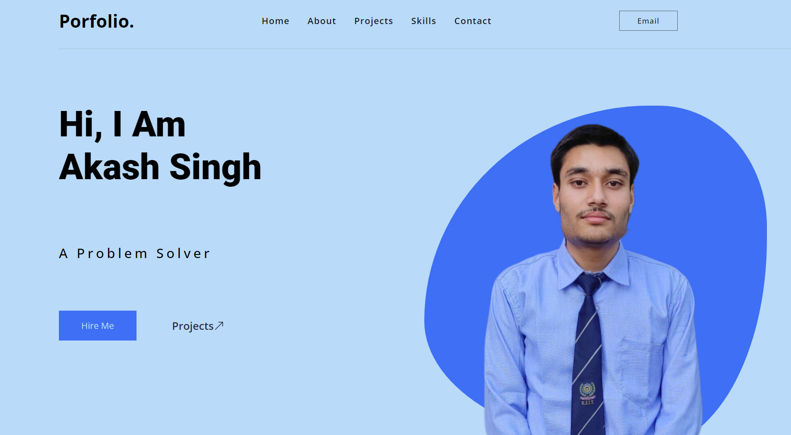

# My Portfolio

## Overview
Welcome to my Portfolio Website, a showcase of my skills, projects, and experiences. This website is developed using React for a modern and interactive user interface.

## Features
* ### React.js for Dynamic UI: 
This website is built with React.js, ensuring a smooth and dynamic user experience. Explore various sections to learn about my skills, projects, and achievements.

* ### Project Showcase: 
Dive into my portfolio and explore the projects I've worked on. Each project comes with detailed information, showcasing my expertise and creativity.

* ### Firebase Contact Page: 
The contact page is powered by Firebase, providing a secure and efficient way to get in touch. Use the contact form to send me messages directly.

* ### Responsive Design: 
The website is designed to be fully responsive, ensuring an optimal viewing experience on a range of devices, from desktops to tablets and mobile phones.

## Getting Started
To run the application locally, follow these steps:

1. Clone the repository: git clone https://github.com/akashnaruka01/my-portfolio.git
2. Install dependencies: npm install
3. Set up a Firebase project and configure the Firebase credentials.
4. Replace the Firebase configuration in the project.
5. Start the development server: npm start

## Dependencies
* React.js
* Firebase (for the contact page)
* Chakra-Ui
* Other dependencies listed in the package.json file

## Contributing
I appreciate contributions! If you have suggestions, improvements, or want to report issues, feel free to submit a pull request or open an issue on the repository.

Explore my portfolio and let's connect! Thanks for visiting.
